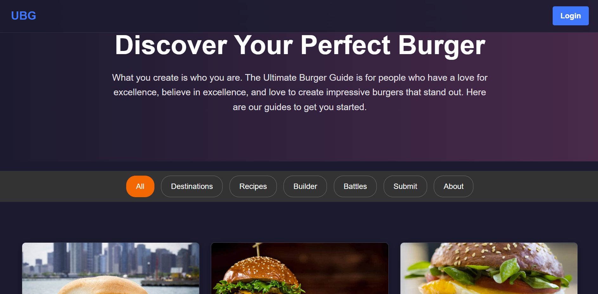
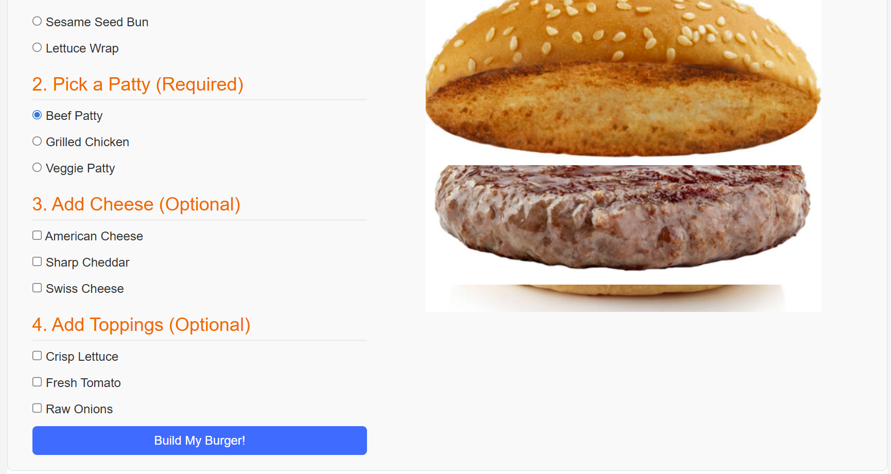
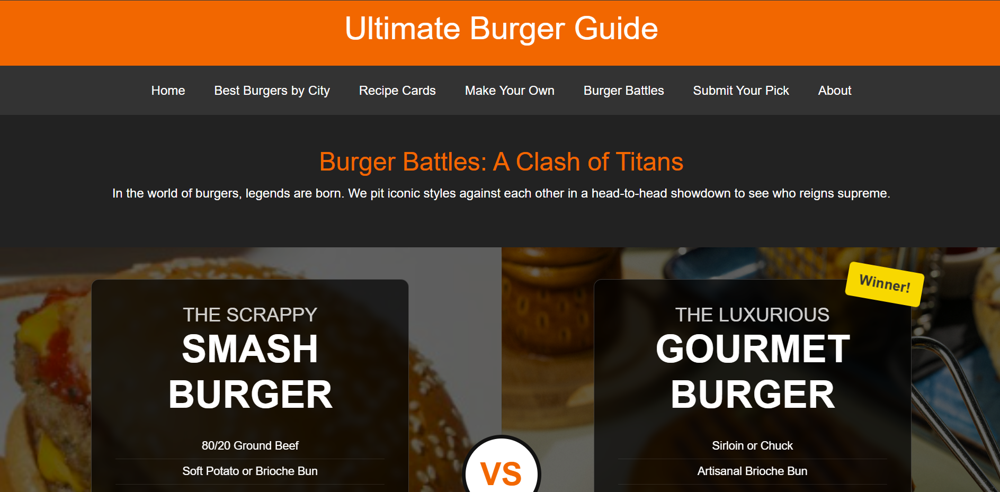

Ultimate Burger Guide README
Overview
The Ultimate Burger Guide is a responsive web application designed for burger enthusiasts to explore, create, and share their love for burgers. It features a variety of tools and resources, including a burger builder, filterable recipe cards, city-based burger recommendations with a real google maps, community submissions, and head-to-head burger battles. The website is built using HTML, CSS, and JavaScript which i learnt through many many videos during this project, with a focus on user interaction and community engagement.

Table of Contents:

Features
Installation
Usage
Developer Documentation
Snapshots

Features

Best Burgers by City: Explore top-rated burgers across 33 states with an interactive map and chart.
Recipe Cards: Browse filterable burger recipes by dietary needs (e.g., vegan, dairy-free) and save favourites.
Interactive Burger Builder: Customize your burger with selectable buns, patties, cheeses, and toppings.
Burger Battles: Compare iconic burger styles in head-to-head showdowns with detailed ingredient lists.
Submit Your Pick: Share your favourite burger joints with the community via a submission form.
Favourites Management: Save and view favourite recipes in a dedicated section.
About Page: Learn about the team and mission behind the Ultimate Burger Guide.
Responsive Design: Optimized for desktop and mobile devices.

Installation
The website is a static HTML/CSS/JavaScript project I have coded over weeks of work provided in a zipped folder. Follow these steps to run it locally:

Unzip the Folder:

Extract the contents of the provided folder to a directory of your choice

Open the Website:

Navigate to the extracted folder and locate Index.html.
Double-click Index.html to open it in your default web browser (e.g., Chrome, Firefox, Edge).
Alternatively, right-click Index.html and select "Open with" to choose your preferred browser.

Requirements:

A modern web browser (Chrome, Firefox, Edge, etc.).

Usage

For Users:
Home Page (Index.html): Start here to explore all features via cards linking to key sections.
Best Burgers by City (City_Burgers.html): View top burgers by state on an interactive map or chart.
Recipe Cards (recipe_cards.html): Filter recipes by dietary needs and save favourites using the heart icon.
Make Your Own (Make_Your_Own.html): Build a custom burger by selecting ingredients and view the result.
Burger Battles (Burger_Battles.html): Compare iconic burgers like the Smash Burger vs. Gourmet Burger.
Submit Your Pick (Submit.html): Submit a favourite burger joint with details and an optional photo.
My Favourite Recipes (favourites.html): View saved recipes from the Recipe Cards page.
About (About.html): Learn about the team and contact them via email.

Navigation:
Use the top navigation bar (present on all pages) to switch between sections.

Technologies Used

HTML5: Structures the content of all pages.
CSS: Styles the layout, using Bootstrap for responsiveness (css/styles.css).
JavaScript: Powers interactivity (e.g., burger builder, recipe filtering, form submissions)(js/scripts.js).
External Libraries:
Map library (using my own personal mymaps) for City_Burgers.html.
Chart library (e.g., Chart.js) for the bar chart in City_Burgers.html.

No Backend: The website is static, with no server-side processing.

Developers:

Map and Chart: The interactive map and chart in City_Burgers.html rely on external libraries (Chart.js and mymaps (which I created)). 
Favourites Functionality: The favourites system (favourites.html, recipe_cards.html) uses local storage. 
Form Submission: The submission form in Submit.html is static and doesnt not go anywhere but will throw and alert/pop-up like a normal commercial website.

Snapshots
Below are snapshots of key pages:

Home Page:

Description: Shows the hero section and feature cards linking to other pages.

Burger Builder:

Description: Displays the interactive burger builder with ingredient selections.

Burger Battles:

Description: Highlights the head-to-head comparison of burger styles.

